# Mongoose Recipes


## Description

In this codealong, we will build a full stack MEN (Mongoose Express Node) application with full CRUD operations and user authentication.  The goal will be to build an app where user's can sign up, sign in, sing out, change their password, and create, read, update, and delete recipes.


## Getting Started

- **Fork** and **Clone** this repository
- `cd` into the newly cloned directory
- `code .` to open in VS Code


## 📖 Table of Contents

- [Setting Up Our Node Environment](#setting-up-our-node-environment)
- [Installing Necessary Packages](#installing-necessary-packages)
- [Ensuring Git Ignores Certain Files/Folders](#ensuring-git-ignores-certain-filesfolders)
- [Setting Up Our Express Server](#setting-up-our-express-server)
- [Connecting Our MongoDB Database](#connecting-our-mongodb-database)
- [Creating Models with the Mongoose Schema Class](#creating-models-with-the-mongoose-schema-class)
- [Setting Up CRUD Operations](#setting-up-crud-operations)
- [Auth CRUD Functionality](#auth-crud-functionality)
- [User CRUD Functionality](#user-crud-functionality)
- [Recipe CRUD Functionality](#recipe-crud-functionality)
- [Reflecting on the Server Build](#reflecting-on-the-server-build)
- [Creating Our EJS Views](#creating-our-ejs-views)
- [Styling (optional)](#styling-optional)
- [Recap & Resources](#recap)

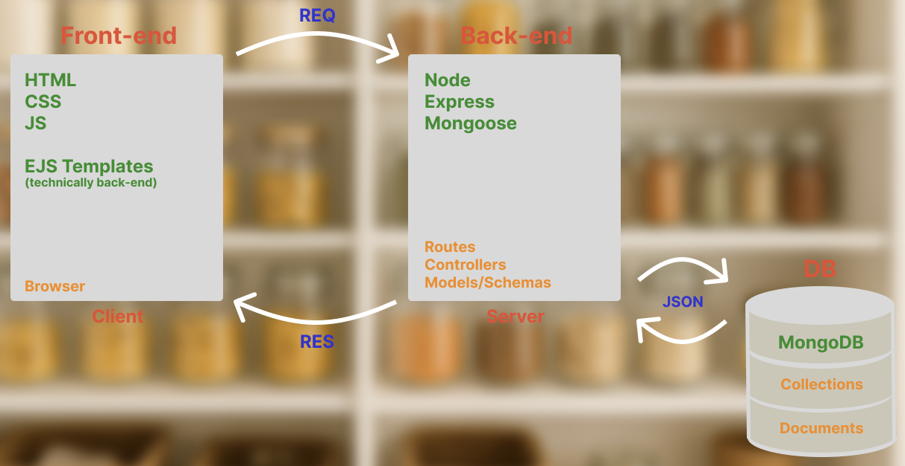


## Setting Up Our Node Environment

First off, we will need to initialize our Node environment so that we can run our server and install and utilize various libraries and packages. In order to do this, we'll run the following command in our terminal:

```sh
npm init -y
```

The `-y` ensures that `yes` is answered to all of the default setup questions.

When this completes, we see a `package.json` file generated in our project directory. This is the "instructions" for our application. It contains important info, and eventually will contain a list of packages that are necessary for our app to run.

[📖 Back to Top](#-table-of-contents)

---


## Installing Necessary Packages

Let's install a few things we're going to need. In your terminal:

```sh
npm install express morgan dotenv mongoose ejs method-override express-session bcrypt
```

Let's break each of these down:

- `express` - a library that will give us tools to run back-end server software
- `morgan` - a library that gives us useful "logging" in our terminal when the request/response cycle occurs
- `dotenv` - a library that allows our JavaScript files to extract environment variables from a `.env` file
- `mongoose` - a library that enables us to set up Schema structures and provides methods for performing CRUD operations on our MongoDB database
- `ejs` - the templating engine that allows us to send HTML (ejs) snippets to our browser from the server side
- `method-override` - allow us to perform PUT/DELETE functionality from an HTML form
- `express-session` - is required for authentication and allows our Express server to access the `session` object
- `bcrypt` - used to *hash* and *compare* our user's password when setting up our session authentication

Once these installs complete, you should see them listed alongside their version numbers in the `"dependencies"` key of your `package.json` file.  A `node_modules` folder and a `package-lock.json` file will also be generated. 

[📖 Back to Top](#-table-of-contents)

---


## Ensuring Git Ignores Certain Files/Folders

Next, we'll need to make sure that things like our node_modules folder do not get tracked by git as we work on our project. In your terminal:

```sh
touch .gitignore
```

Anything we put in this file will not be tracked by git.

For now, put:

```txt
/node_modules
package-lock.json
```

***ALWAYS put `/node_modules` in your gitignore. It is bad practice to push up these files. Putting your `package-lock.json` is an optional step.***

[📖 Back to Top](#-table-of-contents)

---


## Setting Up Our Express Server

We need a file to set up our Express server. By convention, we'll create a `server.js` file in the root of our directory.

```sh
touch server.js
```

In this file, we'll import the express library.

```js
const express = require('express')
```

We also want to import and set up Morgan for logging.

```js
const logger = require('morgan')
```

Next, we'll import Method Override. We'll need this later when we set up our forms.

```js
const methodOverride = require('method-override')
```

Because this app will have authentication, we also need to set up Express Session.

```js
const session = require('express-session')
```

Bring in `dotenv` so we can access our `.env` file.

```js
require('dotenv').config()
```

Now that we've imported these libraries, we need to put them to use. Below your imports:

```js
const app = express()

app.use(logger('dev'))

app.use(methodOverride('_method'))
app.use(session({
  secret: process.env.SESSION_SECRET,
  resave: false,
  saveUninitialized: true
}))
```

Note that the `session` method takes in an object with three key/value pairs:

1.  Our app secret that we will set up in our `.env` later
2.  An option called "resave" set to `false` to ensure that the session object is only restored if modified
3.  An option called "saveUninitialized" set to `true` to ensure that a session object is saved even if it contains no data

We also need to to use two middleware functions from `express`:
- `express.json()` - Parses incoming requests with JSON payloads and makes the data available on req.body
- `express.urlencoded()` - Parses URL-encoded data (from forms) and makes it available on req.body

Below our logger...

```js
app.use(express.json())
app.use(express.urlencoded({ extended: false }))
```

`{ extended: false }` is the option (default) for basic form parsing and will work for most forms. Setting to `true` is for complex forms with arrays and objects as form data.

Let's also set up a base route with a simple response.

```js
app.get('/', (req, res) => {
  res.send('Our app is connected . . . ')
})
```

Just under our imports, set up our `PORT` variable following real-world best practices...

```js
const PORT = process.env.PORT ? process.env.PORT : 3000
```

Finally, at the bottom of the file, let's listen on a certain port for our server to receive requests.

```js
app.listen(PORT, () => {
  console.log(`Running Server on Port ${PORT} . . . `)
})
```

<br>

<details><summary>💡 Your <b>server.js</b> file should look like this so far . . . </summary>

```js
const express = require('express')
const logger = require('morgan')
const methodOverride = require('method-override')
const session = require('express-session')
require('dotenv').config()

const PORT = process.env.PORT ? process.env.PORT : 3000

const db = require('./db')

const app = express()

app.use(logger('dev'))
app.use(express.json())
app.use(express.urlencoded({ extended: false }))
app.use(methodOverride('_method'))
app.use(
  session({
    secret: process.env.SESSION_SECRET,
    resave: false,
    saveUninitialized: true
  })
)

app.get('/', (req, res) => {
  res.send('Our app is connected . . . ')
})

app.listen(PORT, () => {
  console.log(`Running Server on Port ${PORT} . . . `)
})

```

</details>

<br>

[📖 Back to Top](#-table-of-contents)

---


### Running and Testing Our Server

Now that our basic Express server is set up to run, we need to test it out.

In our `package.json` file, let's add a script to run our server. There are two options for this - `nodemon` or `node --watch`:

<br>

<details><summary><b>nodemon</b></summary>

```json
"scripts": {
  "test": "echo \"Error: no test specified\" && exit 1",
  "start": "nodemon server.js"
},
```

</details>

<br>

<details><summary><b>node --watch</b></summary>

```json
"scripts": {
  "test": "echo \"Error: no test specified\" && exit 1",
  "start": "node --watch server.js"
},
```
</details>

<br>

Both do the same thing, but `nodemon` requires another library to execute, while `node` already has the functionality built in. It is your preference.

After our script is set up, we can run our server. In your terminal:

```sh
npm start
```

You should see `"Running Server on Port 3000 . . . "` in your terminal output. Now let's make a request to `'http://localhost:3000/'` with Insomnia to test our base route.

The response you get should be `Our app is connected . . . `. We will eventually replace this with our rendered EJS home page. This is just a test to make sure our server is set up properly.

For now, let's stop our server by pressing <kbd>Ctrl</kbd> + <kbd>C</kbd>.

[📖 Back to Top](#-table-of-contents)

---


## Connecting Our MongoDB Database


---

### Environment Variables

First, let's set up a file where we can hide secure information - a `.env` file.

In terminal:

```sh
touch .env
```

We definitely don't want to push this file to GitHub, so let's immediately add it to the bottom of our `.gitignore` file.

```txt
/node_modules
package-lock.json
.env
```

Leave the `.env` file empty for now.

[📖 Back to Top](#-table-of-contents)

---


### Getting Our Connection String

We need to allow our server to access our database on MongoDB Atlas. To do this, we will always need our secure connection string. 

To access this, sing in to Atlas.

Once you arrive on the Overview page, click the Connect button as shown below:


Select the only option under the Connect to your application header, Drivers:


Click the copy button to add the connection string to your clipboard. You do not need to do anything else on this page.


[📖 Back to Top](#-table-of-contents)

---


### Setting Up the **.env** File

We will take this string and paste it into our `.env` file under the variable name `MONGODB_URI`. Like this:

```txt
MONGODB_URI=mongodb+srv://<your_username>:<db_password>@<cluster_name>.qscuy.azure.mongodb.net/<database-name>?retryWrites=true&w=majority&appName=cluster_name
```

Yours may look completely different than the example above due to the host and region you selected on setup, and that is fine. We need to replace `<db_password>` with our database password. Replace the `< >` as well.

A few of the query parameters at the end are not completely necessary and can be removed also.

```txt
&w=majority
&appName=cluster_name
```

Now we need to name our new database. In the connection string, right after `mongodb.net/` but before the `?`, write the name of the database you are building.

For this app, we'll say `mongoose-recipes`. 

If you do not specify the database, MongoDB will use `test` by default. We don't want that.

Next, since we're already in our `.env`, we need to go ahead and set our `SESSION_SECRET` for later.

```txt
SESSION_SECRET=areallyrandomandlongstring
```

This can be any string. Unpredictable and random is best.

Save your `.env` file. If you left your server running, you'll need to restart it now. Your server always needs to restart after changes to the `.env` file.

[📖 Back to Top](#-table-of-contents)

---


### Connecting to the Database

In our terminal, let's create a `db` directory.

```sh
mkdir db
```

In this directory, we'll need an `index.js` file.

```sh
touch ./db/index.js
```

We'll use this file to establish a connection to our database with `mongoose`.

At the top of the file, we'll import `mongoose`.

```js
const mongoose = require('mongoose')
```

We also need to bring in `dotenv` to allow us to extract and utilize our database connection string. We require it and immediately invoke the `config()` method. No need to store it in a variable.

```js
require('dotenv').config()
```

Now, let's set up an *asynchronous* function to attempt connection with our database.

```js
const connect = async () => {

}
```

In this function, we want to set up a try/catch block to properly handle any errors that might occur during connection.

```js
const connect = async () => {
  try {

  } catch (error) {

  }
}
```

We'll use Mongoose's built in `connect` method to establish our connection then console log the success. In the catch block, we'l simply console.log any errors that occur.

```js
const connect = async () => {
  try {
    await mongoose.connect(process.env.MONGODB_URI)
    console.log('Successfully connected to MongoDB database . . .')
  } catch (error) {
    console.error('Connection Error!', error.message)
  }
}
```

Now, we invoke the function we made:

```js
connect()
```

Finally, we simply export the Mongoose connection.

```js
module.exports = mongoose.connection
```

<br>

<details><summary>💡 Final <b>Mongoose Connection</b> file . . . </summary>

```js
const mongoose = require('mongoose')
require('dotenv').config()

const connect = async () => {
  try {
    await mongoose.connect(process.env.MONGODB_URI)
    console.log('Successfully connected to MongoDB database . . .')
  } catch (error) {
    console.error('Connection Error!', error.message)
  }
}

connect()

module.exports = mongoose.connection
```

</details>

<br>

In order for this to occur when we run our server, we just need to require this file at the top of our `server.js`. This will run the file, and execute our `connect()` function.

In `server.js`, just below our other imports...

```js
const db = require('./db')
```

Now, we run our server and watch our database connection occur!

```sh
npm start
```

We should now see:

```txt
Running Server on Port 3000 . . . 
Successfully connected to MongoDB database . . .
```

[📖 Back to Top](#-table-of-contents)

---


## Creating Models with the Mongoose Schema Class

One of the things that Mongoose allows us to do is to set up templates or *schemas* for our MongoDB documents to follow. This ensures that each document is inserted in the database in a designated way, preventing errors. This takes a non-relational / noSQL database, and gives it many of the advantages of a relational / SQL database. It's the best of both worlds!


---

### Mapping Our Application with an ERD

ERD stands for **E**ntity **R**elationship **D**iagram. We use this as a way of planning our database structure and devising our models. In this app, we want to have Users that can sign up, sign in, and add many Recipes. So we'll need two models - **User** and **Recipe**. When making an ERD, think of the fields and datatypes you will need, as well as the relationships between your models. In this case, we'll establish a ***One to Many*** relationship. Here is the ERD we will need:

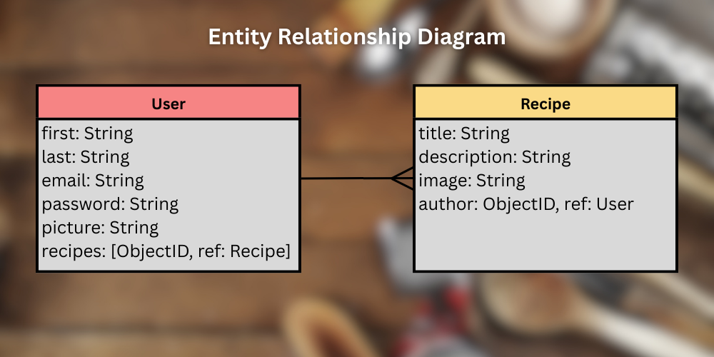

There are many different tools you can use for creating an ERD. This one was made with [Canva](http://www.canva.com), but you could use anything. I've listed a few options in the [Resources Section](#📚-resources).

Now that we have our plan in place, let's start setting up our model files.

[📖 Back to Top](#-table-of-contents)

---


### Creating Our User Model

Let's start off by making a `models` directory.

```sh
mkdir models
```

In this folder, we'll create a file for the particular resource we want a schema for. For this app, since we will have authentication, we will need a `User` model. By convention, when we name this file, the resource is **singular** and **PascalCased** since it represents the template we will follow for a *single* document. Name the file `User.js`.

```sh
touch ./models/User.js
```

In this file, we'll need access to the mongoose object, so let's import that.

```js
const mongoose = require('mongoose')
```

Now, we'll need a new instance of the *Schema class* from Mongoose. In JavaScript, classes can be used to create reusable objects that all share similar properties and methods (built-in functions).  Mongoose uses this to create a new model for us. By convention, the name of this variable will be our resource + Schema to clearly designate it.

```js
const userSchema = new mongoose.Schema({

})
```

The *new* keyword says to JavaScript that we want a brand new object generated from the `mongoose.Schema` class. When this happens, the object we get back has all the properties and methods available to Schemas in Mongoose. 

Inside of this, we simply need to pass in a few options to set up our model. We want to tell it the different key/value pairs we want and the datatypes that we expect them to be.

For our User model, let's reference our [ERD](#mapping-our-application-with-an-erd) (entity relationship diagram) to take note of the fields we'll need. Notice that the datatype options are capitalized.

We'll *require* `first`, `last`, and `email`. We'll also make sure to set up our relationship to the Recipe model by making `recipes` an array of ObjectIDs.

`{ timestamps: true }` as a secondary argument to `Schema` ensures that we receive `createdAt` and `updatedAt` fields when the document is created/updated in MongoDB.

```js
const userSchema = new mongoose.Schema(
  {
    first: { type: String, required: true },
    last: { type: String, required: true },
    email: { type: String, required: true },
    password: { type: String, required: true },
    picture: { type: String },
    recipes: [{ type: mongoose.Schema.Types.ObjectId, ref: 'Recipe' }]
  },
  { timestamps: true }
)
```

Then, we need to use Mongoose's model() method to turn our regular schema into a true model, giving it much more abilities! We do that with this line:

```js
const User = mongoose.model('User', userSchema)
```

By convention, the first argument to this method will be a *PascalCased* string of our collection name - in this case, `"User"`. The second argument is the `userSchema` variable from above.

Now we export it so that we can utilize it elsewhere in our app.

```js
module.exports = User
```

Our model is now ready to be used to perform CRUD operations on our database!

<br>

<details>
<summary>💡 Final <b>User</b> Model file . . . </summary>

```js
const mongoose = require('mongoose')

const userSchema = new mongoose.Schema(
  {
    first: { type: String, required: true },
    last: { type: String, required: true },
    email: { type: String, required: true },
    password: { type: String, required: true },
    picture: { type: String },
    recipes: [{ type: mongoose.Schema.Types.ObjectId, ref: 'Recipe' }]
  },
  { timestamps: true }
)

const User = mongoose.model('User', userSchema)

module.exports = User
```

</details>

<br>

[📖 Back to Top](#-table-of-contents)

---


### Creating Our Recipe Model

We'll follow the same pattern for setting up our Recipe model. First, we need our file...

```sh
touch ./models/Recipe.js
```

In this file, we'll need access to the mongoose object, so let's import that again.

```js
const mongoose = require('mongoose')
```

Now, we'll need a new instance of the *Schema class* from Mongoose. By convention, the name of this variable will be our resource + Schema to clearly designate it.

```js
const recipeSchema = new mongoose.Schema({

})
```

For our Recipe model, let's reference our [ERD](#mapping-our-application-with-an-erd) (entity relationship diagram) again to take note of the fields we'll need.

We'll *require* `title`, `description`, and `author`. We'll also make sure to set up our relationship to the User model by making `author` an ObjectID.

We'll want `{ timestamps: true }` on these documents as well.

```js
const recipeSchema = new mongoose.Schema(
  {
    title: { type: String, required: true },
    description: { type: String, required: true },
    image: { type: String },
    author: { type: mongoose.Schema.Types.ObjectId, ref: 'User', required: true }
  },
  { timestamps: true }
)
```

Then, we need to use Mongoose's `.model()` method to turn our regular schema into a true model, giving it much more abilities! We do that with this line:

```js
const Recipe = mongoose.model('Recipe', recipeSchema)
```

Now we export it so that we can utilize it elsewhere in our app.

```js
module.exports = Recipe
```

Our model is now ready to be used to perform CRUD operations on our database!

<br>

<details>
<summary>💡 Final <b>Recipe</b> Model file . . . </summary>

```js
const mongoose = require('mongoose')

const recipeSchema = new mongoose.Schema(
  {
    title: { type: String, required: true },
    description: { type: String, required: true },
    image: { type: String },
    author: {
      type: mongoose.Schema.Types.ObjectId,
      ref: 'User',
      required: true
    }
  },
  { timestamps: true }
)

const Recipe = mongoose.model('Recipe', recipeSchema)

module.exports = Recipe
```

</details>

<br>

[📖 Back to Top](#-table-of-contents)

---


## Setting Up CRUD Operations


---

### Folder Structure

In order to keep our application organized and set up for future expansion and growth in functionality and scope, we will arrange our file structure in a certain way. 

Let's create two new folders...

```sh
mkdir routes controllers
```

In each of these folders, we'll have a file for each resource.  It's also a good idea to have a separate one for *auth* actions. Let's create these:

```sh
touch ./routes/userRouter.js ./routes/recipeRouter.js ./routes/authRouter.js
```

and...

```sh
touch ./controllers/userController.js ./controllers/recipeController.js ./controllers/authController.js
```

This creates a separate route and controller file for **User**, **Recipe**, and all of our **Auth** concerns.

- The *route files* will have assigned URL endpoints and their associated controller functions.

- The *controller files* will have all of the functions and their logic. This is where the actual querying of the database will occur.

[📖 Back to Top](#-table-of-contents)

---


### Following a Repeatable Pattern for Creating Each CRUD Operation

In this section, we'll follow the same pattern over and over as we set up each CRUD operation for each resource.

The pattern is:

1.  Define the route
2.  Set up the controller function
3.  Test in Insomnia/Postman

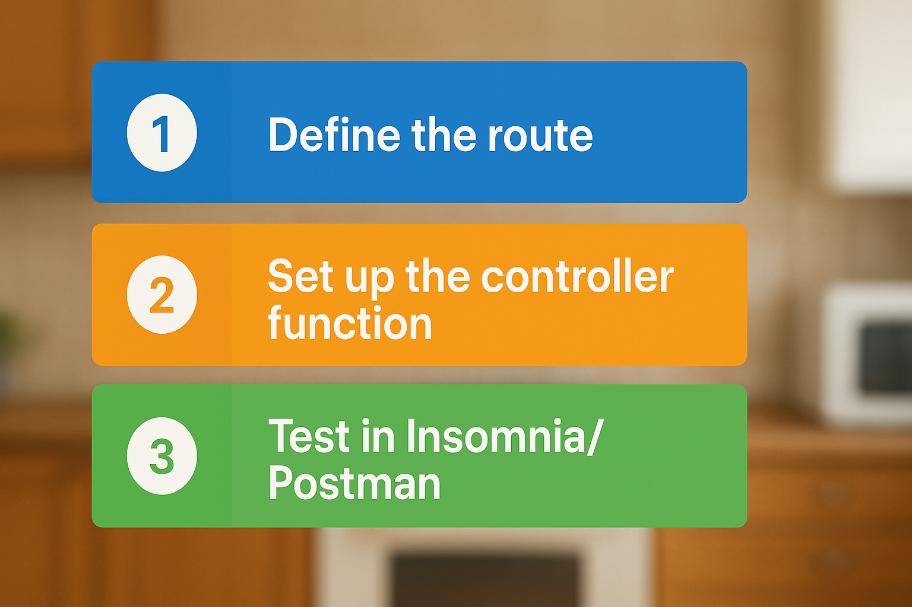

Creating and testing the EJS views will be done *after* we know all of our server functionality is working. In a real world application *or* your project, this same workflow should be followed. Planning, back-end, testing, *then* front-end, and more testing.

[📖 Back to Top](#-table-of-contents)

---


## Auth CRUD Functionality

Following the pattern, we'll first set up the route.

These are the full routes we will be setting up in this section:

| HTTP Method | Route |
| :---: | :---: |
| [POST](#registering-a-user) | [http://localhost:3000/auth/sign-up](#registering-a-user) |
| [POST](#signing-in-a-user) | [http://localhost:3000/auth/sign-in](#signing-in-a-user) |
| [GET](#signing-out-a-user) | [http://localhost:3000/auth/sign-out](#signing-out-a-user) |

Let's head over to `server.js` and set up our base route (`'/auth'`) and link up our Router file.

At the top, just below our package imports, we need to import our router from `authRouter.js`:

```js
const authRouter = require('./routes/authRouter.js')
```

*Underneath* the middleware stack, but *above* our app entry point (`'/'`):

```js
app.use('/auth', authRouter)
```

This tells our application that any endpoint that starts with `'http://localhost:3000/auth'` needs to go to our `authRouter` for further routing.

[📖 Back to Top](#-table-of-contents)

---


### Registering a User

Now, over in `authRouter.js`, let's set everything up. First, import `express` and set up the `router` object.

```js
const express = require('express')
const router = express.Router()
```

Now, we'll set up the method (`POST`) with the `router` object and point to the controller function we intend to use for it.

```js
router.post('/sign-up', )
```

The second argument to `.post` will be our imported controller (which we have not made yet). We'll call it `registerUser`.

Let's pause here with it half-complete and go set that up.

In `authController.js`, we'll set up a bunch of functions for various functionality and export them.

First, we need to import `bcrypt` since we will be using it to *hash* and later *compare* our user's passwords.

```js
const bcrypt = require('bcrypt')
```

We will also need access to our `User` model since we will be creating a new User document on sign-up.

```js
const User = require('../models/User.js')
```

Now, let's start making our *async* `registerUser` function. Best practice is to always use a try/catch block to best handle errors.

```js
const registerUser = async (req, res) => {
  try {

  } catch (error) {

  }
}
```

Following what we learned in the Session Auth lesson, we'll follow these steps:
1. Check if a user exists with the provided email
2. Make sure the user's passwords match
3. Hash the user's password with `bcrypt`
4. Create the user in the database with our model
5. Send the user a response

First, we'll check the database for the user:

```js
const userInDatabase = await User.findOne({ email: req.body.email })
if (userInDatabase) {
  return res.send('Username already taken!')
  // This will be an EJS page later...
}
```

Now, to check the passwords:

```js
if (req.body.password !== req.body.confirmPassword) {
  return res.send('Password and Confirm Password must match')
  // This will be also be an EJS page...
}
```

Hashing the password with `bcrypt`:

```js
const hashedPassword = bcrypt.hashSync(req.body.password, 12)
```

Now, creating the user:

```js
const user = await User.create({
  email: req.body.email,
  password: hashedPassword,
  first: req.body.first,
  last: req.body.last,
  picture: req.body.picture,
  recipes: []
})
```

Finally, sending a response:

```js
res.send(`Thanks for signing up, ${user.first}!`)
// This will be an EJS page later...
```

Don't forget to handle your errors:

```js
} catch (error) {
  console.error('An error has occurred registering a user!', error.message)
}
```

At the bottom of our file, we'll create a module.exports that will export all of the functions we make.

```js
module.exports = {
  registerUser
}
```

<br>

<details>
<summary>💡 Our <b>authController</b> file so far . . . </summary>

```js
const bcrypt = require('bcrypt')

const User = require('../models/User.js')

const registerUser = async (req, res) => {
  try {
    const userInDatabase = await User.findOne({ email: req.body.email })
    if (userInDatabase) {
      return res.send('Username already taken!')
      // This will be an EJS page later...
    }
    if (req.body.password !== req.body.confirmPassword) {
      return res.send('Password and Confirm Password must match')
      // This will be also be an EJS page...
    }
    const hashedPassword = bcrypt.hashSync(req.body.password, 12)
    const user = await User.create({
      email: req.body.email,
      password: hashedPassword,
      first: req.body.first,
      last: req.body.last,
      picture: req.body.picture,
      recipes: []
    })
    res.send(`Thanks for signing up, ${user.first}!`)
    // This will be an EJS page later...
  } catch (error) {
    console.error('An error has occurred registering a user!', error.message)
  }
}

module.exports = {
  registerUser
}
```

</details>

<br>

Now, head back to our `authRouter.js` file and we will hook everything up.

At the top, import our controller.

```js
const authController = require('../controllers/authController.js')
```

In the route we left hanging earlier, we'll simply reference the function we want to use!

```js
router.post('/sign-up', authController.registerUser)
```

Below this, we need to export `router`.

```js
module.exports = router
```

<br>

<details>
<summary>💡 Our <b>authRouter</b> file so far . . . </summary>

```js
const express = require('express')
const router = express.Router()

const authController = require('../controllers/authController.js')

router.post('/sign-up', authController.registerUser)

module.exports = router
```

</details>

<br>

Run your server...

```sh
npm start
```

You'll see:

```txt
Running Server on Port 3000 . . . 
Successfully connected to MongoDB database . . .
```

Now, we test with Insomnia or Postman - a `POST` request to `'http://localhost:3000/auth/sign-up'` with something like the following as the request body:

```json
{
  "first": "John",
  "last": "Doe",
  "email": "john.doe@email.com",
  "password": "john1234",
  "confirmPassword": "john1234",
  "picture": "https://imgur.com/a/1VRyfxY"

}
```

Later, this will be coming from our Form fields in our EJS.

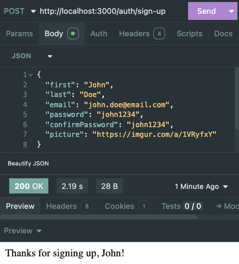

We've completed the process from *route* to *controller* to *testing*! Now, on to the next bit of functionality.

[📖 Back to Top](#-table-of-contents)

---


### Signing In A User

Now, back in `authRouter.js`, let's work on a new route.

Again, we'll set up the method (`POST`) with the `router` object and point to the controller function we intend to use for it. Below our sign-up route...

```js
router.post('/sign-in', )
```

The second argument to `.post` will be our imported controller (which we have not made yet). We'll call it `signInUser`.

Let's pause here with it half-complete and go set that up.

In `authController.js`, below `registerUser`, let's start making our *async* `signInUser` function.

```js
const signInUser = async (req, res) => {
  try {

  } catch (error) {

  }
}
```

Following what we learned in the Session Auth lesson, we'll follow these steps:
1. Check if a user exists with the provided email
2. Compare the user's password with `bcrypt`
3. Create the session object
4. Send the user a response

First, we'll check the database for the user:

```js
const user = await User.findOne({ email: req.body.email })
if (!user) {
  return res.send('No user has been registered with that email. Please sign up!')
  // This will be an EJS page later...
}
```

Comparing the password with `bcrypt`:

```js
const validPassword = bcrypt.compareSync(
  req.body.password,
  user.password
)
if (!validPassword) {
  return res.send('Incorrect password! Please try again.')
}
```

`bcrypt.compareSync()` will return a `boolean` value.

Now, creating the `session` object:

```js
req.session.user = {
  username: user.username,
  _id: user._id
}
```

Finally, sending a response:

```js
res.send(`Thanks for signing in, ${user.first}!`)
// This will be an EJS page or redirect later...
```

Don't forget to handle your errors:

```js
} catch (error) {
  console.error('An error has occurred signing in a user!', error.message)
}
```

At the bottom of our file, add the function to the export...

```js
module.exports = {
  registerUser,
  signInUser
}
```

<br>

<details>
<summary>💡 Final <b>signInUser</b> function . . . </summary>

```js
const signInUser = async (req, res) => {
  try {
    const user = await User.findOne({ email: req.body.email })
    if (!user) {
      return res.send(
        'No user has been registered with that email. Please sign up!'
      )
      // This will be an EJS page later...
    }
    const validPassword = bcrypt.compareSync(
      req.body.password,
      user.password
    )
    if (!validPassword) {
      return res.send('Incorrect password! Please try again.')
      // This will be also be an EJS page...
    }
    req.session.user = {
      username: user.username,
      _id: user._id
    }
    res.send(`Thanks for signing in, ${user.first}!`)
    // This will be an EJS page or redirect later...
  } catch (error) {
    console.error('An error has occurred signing in a user!', error.message)
  }
}
```

</details>

<br>

Now, head back to our `authRouter.js` file and we will hook everything up.

In the route we left unfinished, reference the controller.

```js
router.post('/sign-in', authController.signInUser)
```

<br>

<details>
<summary>💡 Our <b>authRouter</b> file so far . . . </summary>

```js
const express = require('express')
const router = express.Router()

const authController = require('../controllers/authController.js')

router.post('/sign-up', authController.registerUser)
router.post('/sign-in', authController.signInUser)

module.exports = router
```

</details>

<br>

Run your server...

```sh
npm start
```

You'll see:

```txt
Running Server on Port 3000 . . . 
Successfully connected to MongoDB database . . .
```

Now, we test with Insomnia or Postman - a `POST` request to `'http://localhost:3000/auth/sign-in'` with something like the following as the request body:

```json
{
  "email": "john.doe@email.com",
  "password": "john1234"
}
```

Later, this will be coming from our Form fields in our EJS.

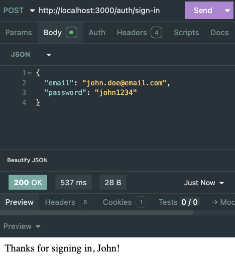

We've completed the process again from *route* to *controller* to *testing*! Now, we go again!

[📖 Back to Top](#-table-of-contents)

---


### Signing Out A User

We can quickly set up our route and controller for signing out. Same pattern.

In `authRouter.js`, we set up the route.

Below our sign-in route. Note that we are making a `GET` request...

```js
router.get('/sign-out', )
```

The second argument to `.get` will be our imported controller (which we have not made yet). We'll call it `signOutUser`.

Let's pause here with it half-complete and go set that up.

In `authController.js`, below `signInUser`, let's start making our `signOutUser` function.

```js
const signOutUser = (req, res) => {
  try {

  } catch (error) {

  }
}
```

Following what we learned in the Session Auth lesson, we'll follow these steps:
1. Destroy the session object
2. Redirect the user to another page

We'll use the `session` object's built in `.destroy()` method:

```js
req.session.destroy()
```

Then, send the user back to the home page (which we'll build in EJS later):

```js
res.redirect('/')
```

Don't forget to handle your errors:

```js
} catch (error) {
  console.error('An error has occurred signing out a user!', error.message)
}
```

At the bottom of our file, add the function to the export...

```js
module.exports = {
  registerUser,
  signInUser,
  signOutUser
}
```

<br>

<details>
<summary>💡 Final <b>signOutUser</b> function . . . </summary>

```js
const signOutUser = (req, res) => {
  try {
    req.session.destroy()
    res.redirect('/')
  } catch (error) {
    console.error('An error has occurred signing out a user!', error.message)
  }
}
```

</details>

<br>

Now, head back to our `authRouter.js` file and hook it up.

In the route we left unfinished, reference the controller.

```js
router.get('/sign-out', authController.signOutUser)
```

<br>

<details>
<summary>💡 Our <b>authRouter</b> file so far . . . </summary>

```js
const express = require('express')
const router = express.Router()

const authController = require('../controllers/authController.js')

router.post('/sign-up', authController.registerUser)
router.post('/sign-in', authController.signInUser)
router.get('/sign-out', authController.signOutUser)

module.exports = router
```

</details>

<br>

Run your server...

```sh
npm start
```

You'll see:

```txt
Running Server on Port 3000 . . . 
Successfully connected to MongoDB database . . .
```

Now, we test with Insomnia or Postman - a `GET` request to `'http://localhost:3000/auth/sign-out'`. No request body needed.

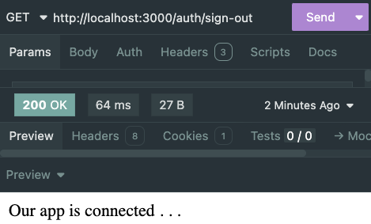

We've completed the process again from *route* to *controller* to *testing*! Don't stop now!

[📖 Back to Top](#-table-of-contents)

---


## User CRUD Functionality

As we proceed to this next section, it's important to reflect on the website we *want* to make. What functionality do we want our user to have? What page views are we thinking we'll show? 

We've set up a couple routes that have to do with the user, sorted separately in Auth because they had to do with registering, signing in, and signing out. But what if we wanted a page that showed a user's profile? We need to consider what data our back-end server needs to send to the page, and how to get it.

These are the full routes we will be setting up in this section:

| HTTP Method | Route |
| :---: | :---: |
| [GET](#getting-a-users-profile) | [http://localhost:3000/users/:id](#getting-a-users-profile) |
| [PUT](#updating-a-users-password) | [http://localhost:3000/auth/:id](#updating-a-users-password) |

Let's head over to `server.js` and set up our base route (`'/users'`) and link up our Router file.

At the top, just below our `authRouter` import, we need to import our router from `userRouter.js`:

```js
const userRouter = require('./routes/userRouter.js')
```

*Underneath* the Auth Router, but *above* our app entry point (`"/"`):

```js
app.use('/users', userRouter)
```

This tells our application that any endpoint that starts with `'http://localhost:3000/users'` needs to go to our `userRouter` for further routing.

[📖 Back to Top](#-table-of-contents)

---


### Getting a User's Profile

In order to set this up, we'll follow the exact same pattern. Route - Controller - Testing.

Now, over in `userRouter.js`, let's set it up. First, import `express` and set up the `router` object. We need this at the top of *all* our Router files.

```js
const express = require('express')
const router = express.Router()
```

Now, we'll set up the method (`GET`) with the `router` object and point to the controller function we intend to use for it.

```js
router.get('/:id', )
```

The second argument to `.get` will be our imported controller (which we have not made yet). We'll call it `getUserById`.

Let's pause here with it half-complete and go set that up.

In `userController.js`, we'll set up this function.

We will need access to our `User` model since we will be using it's `findById` method to query the database.

```js
const User = require('../models/User.js')
```

Now, let's start making our *async* `getUserById` function. Best practice is to always use a try/catch block to best handle errors.

```js
const getUserById = async (req, res) => {
  try {

  } catch (error) {

  }
}
```

This one is pretty straight forward:
1. We need to extract the user's ID from the URL params
2. Use that ID to query the database
3. Curate our response to ensure it does not contain sensitive user information

First, we'll use `findById` to query the database with the `id` from `params`:

```js
const user = await User.findById(req.params.id)
// Returns the full user object, including their hashed password. Never send this to anyone other than the user it belongs to.
```

Now, to create a *new* object that only contains the data we want to send to the page:

```js
const data = {
  first: user.first,
  last: user.last,
  picture: user.picture,
  recipes: user.recipes
}
// Notice we have left out sensitive info like the user's email and hashed password.
```

Now, to send it back as a response:

```js
res.send(data)
// This will be an EJS page later...
```

Don't forget to handle your errors:

```js
} catch (error) {
  console.error('An error has occurred finding a user!', error.message)
}
```

At the bottom of our file, we'll create a module.exports that will export all of the functions we make.

```js
module.exports = {
  registerUser
}
```

<br>

<details>
<summary>💡 Our <b>userController</b> file so far . . . </summary>

```js
const User = require('../models/User.js')

const getUserById = async (req, res) => {
  try {
    const user = await User.findById(req.params.id)
    // Returns the full user object, including their hashed password. Never send this to anyone other than the user it belongs to.
    const data = {
      first: user.first,
      last: user.last,
      picture: user.picture,
      recipes: user.recipes
    }
    // Notice we have left out sensitive info like the user's email and hashed password.
    res.send(data)
    // This will be an EJS page later...
  } catch (error) {
    console.error('An error has occurred finding a user!', error.message)
  }
}

module.exports = {
  getUserById
}
```

</details>

<br>

Now, head back to our `userRouter.js` file and we will hook it up.

At the top, import our controller.

```js
const userController = require('../controllers/userController.js')
```

In the route we left hanging earlier, we'll simply reference the function we want to use!

```js
router.post('/sign-up', authController.registerUser)
```

Below this, we need to export `router`.

```js
module.exports = router
```

<br>

<details>
<summary>💡 Our <b>userRouter</b> file so far . . . </summary>

```js
const express = require('express')
const router = express.Router()

const userController = require('../controllers/userController.js')

router.get('/:id', userController.getUserById)

module.exports = router
```

</details>

<br>

Run your server...

```sh
npm start
```

You'll see:

```txt
Running Server on Port 3000 . . . 
Successfully connected to MongoDB database . . .
```

Now, we test with Insomnia or Postman - a `GET` request to `"http://localhost:3000/users/<some-users-id>"` with a *real ObjectID* of a user you've made in your database:

Later, this will be coming from our route that we direct a user to when they click on another user's profile.

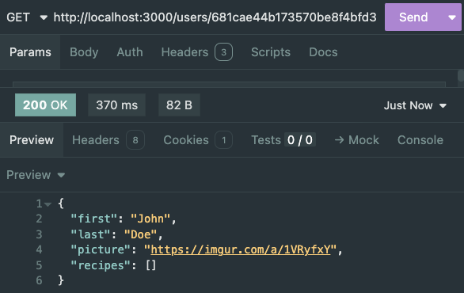

Again - *route* to *controller* to *testing*!

[📖 Back to Top](#-table-of-contents)

---


### Updating a User's Password

We want our user to be able to update and change their password. It's important to have this separate from any other updates they might make to their profile like a change of email or profile picture. Now, where you do this is up to you. For us, in order to keep these things separate, We're going to store the update password functionality in Auth and use `"/auth"` routes to do it.

In `authRouter.js`, we'll set up the method (`PUT`) with the `router` object and point to the controller function we intend to use for it.

```js
router.put('/:id', )
```

The second argument to `.put` will be our imported controller (which we have not made yet). We'll call it `updatePassword`.

Let's pause here with it half-complete.

In `authController.js`, we need `bcrypt` since we will be using it to *compare* the old password and to *hash* the new password, and we already have it imported from earlier.

We will also need access to our `User` model to perform the update, and it's already imported also.

Now, let's start making our *async* `updatePassword` function. We'll use try/catch as usual.

```js
const updatePassword = async (req, res) => {
  try {

  } catch (error) {

  }
}
```

Following what we learned in the Session Auth lesson, we'll apply them to this functionality as well and follow these steps:
1. Check if a user exists with the provided ID
2. Make sure the user's old password is legitimate with `bcrypt`
3. Make sure the user's new passwords match
4. Hash the user's new password with `bcrypt`
5. Update the user in the database
6. Send the user a response

First, we'll check the database for the user:

```js
const user = await User.findById(req.params.id)
if (!user) {
  return res.send('No user with that ID exists!')
  // This will be an EJS page later...
}
```

Now, to check the user's new password:

```js
if (req.body.newPassword !== req.body.confirmPassword) {
  return res.send('Password and Confirm Password must match')
  // This will be also be an EJS page...
}
```

Hashing the new password with `bcrypt`:

```js
const hashedPassword = bcrypt.hashSync(req.body.newPassword, 12)
```

Now, updating the user. We already have the user's record from our `findById`, so there's no need to do a new `findByIdAndUpdate`. We'll just update the `password` field and `.save()`:

```js
user.password = hashedPassword
// It's critical that this field is updated with the password we hashed with bcrypt, and never the plain text password in req.body.password
await user.save()
```

Finally, sending a response:

```js
res.send(`Your password has been updated, ${user.first}!`)
// This will be an EJS page later...
```

Don't forget to handle your errors:

```js
} catch (error) {
  console.error("An error has occurred updating a user's password!", error.message)
}
```

At the bottom of our file, add the function to the module.exports.

```js
module.exports = {
  registerUser,
  signInUser,
  signOutUser,
  updatePassword
}
```

<br>

<details>
<summary>💡 Final <b>updatePassword</b> function . . . </summary>

```js
const updatePassword = async (req, res) => {
  try {
    const user = await User.findById(req.params.id)
    if (!user) {
      return res.send('No user with that ID exists!')
      // This will be an EJS page later...
    }
    if (req.body.newPassword !== req.body.confirmPassword) {
      return res.send('Password and Confirm Password must match')
      // This will be also be an EJS page...
    }
    const hashedPassword = bcrypt.hashSync(req.body.newPassword, 12)
    user.password = hashedPassword
    // It's critical that this field is updated with the password we hashed with bcrypt, and never the plain text password in req.body.password
    await user.save()
    res.send(`Your password has been updated, ${user.first}!`)
    // This will be an EJS page later...
  } catch (error) {
    console.error(
      'An error has occurred updating a user's password!',
      error.message
    )
  }
}
```

</details>

<br>

Now, head back to our `authRouter.js` file and we will hook it up.

In the route we left earlier, we'll reference the function!

```js
router.put('/:id', authController.updatePassword)
```

<br>

<details>
<summary>💡 Our <b>authRouter</b> file so far . . . </summary>

```js
const express = require('express')
const router = express.Router()

const authController = require('../controllers/authController.js')

router.post('/sign-up', authController.registerUser)
router.post('/sign-in', authController.signInUser)
router.post('/sign-out', authController.signOutUser)
router.put('/:id', authController.updatePassword)

module.exports = router
```

</details>

<br>

Run your server...

```sh
npm start
```

You'll see:

```txt
Running Server on Port 3000 . . . 
Successfully connected to MongoDB database . . .
```

Now, we test with Insomnia or Postman - a `PUT` request to `'http://localhost:3000/auth/<some-users-id>'` with something like the following as the request body:

```json
{
  "password": "john1234",
  "newPassword": "1234john",
  "confirmPassword": "1234john"
}
```

Later, this will be coming from our Form fields in our EJS.

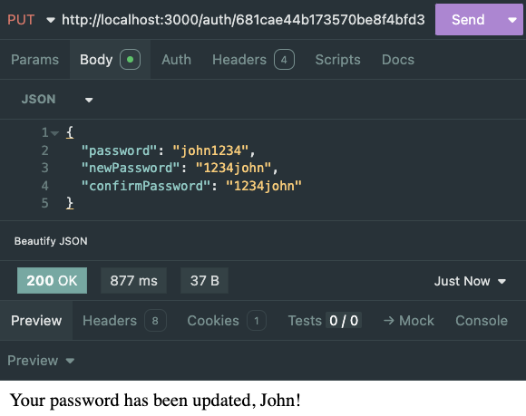

Another round with the pattern - complete!

[📖 Back to Top](#-table-of-contents)

---


## Recipe CRUD Functionality

Let's think again about the website we *want* to make. What functionality do we want our user to have? What page views are we thinking we'll show? 

We want our user to be able to create new recipes. We want to show a list of a bunch of recipes. We want to be able to go deeper and see details about a single recipe. We want a user to be able to update and delete their own recipes.

These are the full routes we will be setting up in this section:

| HTTP Method | Route |
| :---: | :---: |
| [POST](#creating-a-recipe) | [http://localhost:3000/recipes/](#creating-a-recipe) |
| [GET](#getting-all-recipes) | [http://localhost:3000/recipes/](#getting-all-recipes) |
| [GET](#get-a-single-recipe) | [http://localhost:3000/recipes/:id](#get-a-single-recipe) |
| [PUT](#update-a-recipe) | [http://localhost:3000/recipes/:id](#update-a-recipe) |
| [DELETE](#delete-a-recipe) | [http://localhost:3000/recipes/:id](#delete-a-recipe) |

Let's head over to `server.js` and set up our base route (`'/recipes'`) and link up our Router file.

At the top, just below our `userRouter` import, we need to import our router from `recipeRouter.js`:

```js
const recipeRouter = require('./routes/recipeRouter.js')
```

*Underneath* the User Router, but *above* our app entry point (`'/'`):

```js
app.use('/recipes', recipeRouter)
```

This tells our application that any endpoint that starts with `'http://localhost:3000/recipes'` needs to go to our `recipeRouter` for further routing.

[📖 Back to Top](#-table-of-contents)

---


### Creating a Recipe

In order to set this up, we'll follow the pattern again. Route - Controller - Testing.

In `recipeRouter.js`, import `express` and set up the `router` object. We need this at the top of *all* of our Router files.

```js
const express = require('express')
const router = express.Router()
```

Now, we'll set up the method (`POST`) with the `router` object and point to the controller function we intend to use for it.

```js
router.post('/', )
```

The second argument to `.post` will be our imported controller (which we have not made yet). We'll call it `createRecipe`.

Let's pause here.

In `recipeController.js`, we'll set up this function.

We will need access to our `Recipe` model since we will be using it's `create` method to add a recipe document to our database. 

But we also need access to our `User` model since we need to add the new recipe to our user's array of recipes.

```js
const User = require('../models/User.js')
const Recipe = require('../models/Recipe.js')
```

Now, let's start making our *async* `createRecipe` function. Best practice is to always use a try/catch.

```js
const createRecipe = async (req, res) => {
  try {

  } catch (error) {

  }
}
```

A few steps involved with this one:
1. Find the user that is associated with this recipe (we are expecting it in the `req.body`)
2. Create our recipe with the `Recipe` model
3. Update our user in the database by adding our new recipe's ObjectID to their array
4. Send a response

First, we'll use `findById` to query the database with the user's `id` from the request body labeled as `author`:

```js
const user = await User.findById(req.body.author)
// Returns the full user object
```

Now, to create our recipe:

```js
const recipe = await Recipe.create(req.body)
// The only way this works this simply is if the request body being sent properly matches your model
```

Now that we have our new recipe back, let's add it to our user object. Then we update that document with the `.save()` method:

```js
user.recipes.push(recipe._id)
// The MongoDB ObjectID is what needs to be in this array for the reference to work
user.save()
```

Finally, we send a response:

```js
res.send(recipe)
// This will be an EJS page later...
```

Don't forget to handle your errors:

```js
} catch (error) {
  console.error('An error has occurred creating a recipe!', error.message)
}
```

At the bottom of our file, we'll create a module.exports that will export all of the functions we make.

```js
module.exports = {
  createRecipe
}
```

<br>

<details>
<summary>💡 Our <b>recipeController</b> file so far . . . </summary>

```js
const User = require('../models/User.js')
const Recipe = require('../models/Recipe.js')

const createRecipe = async (req, res) => {
  try {
    const user = await User.findById(req.body.author)
    // Returns the full user object
    const recipe = await Recipe.create(req.body)
    // The only way this works this simply is if the request body being sent properly matches your model
    user.recipes.push(recipe._id)
    user.save()
    res.send(recipe)
    // This will be an EJS page later...
  } catch (error) {
    console.error('An error has occurred creating a recipe!', error.message)
  }
}

module.exports = {
  createRecipe
}
```

</details>

<br>

Now, head back to our `recipeRouter.js` file and we will hook it up.

At the top, import our controller.

```js
const recipeController = require('../controllers/recipeController.js')
```

In the route we left hanging earlier, we'll simply reference the function we want to use!

```js
router.post('/', recipeController.createRecipe)
```

Below this, we need to export `router`.

```js
module.exports = router
```

<br>

<details>
<summary>💡 Our <b>recipeRouter</b> file so far . . . </summary>

```js
const express = require('express')
const router = express.Router()

const recipeController = require('../controllers/recipeController.js')

router.post('/', recipeController.createRecipe)

module.exports = router
```

</details>

<br>

Run your server...

```sh
npm start
```

You'll see:

```txt
Running Server on Port 3000 . . . 
Successfully connected to MongoDB database . . .
```

Now, we test with Insomnia or Postman - a `POST` request to `'http://localhost:3000/recipes'` with something like the following as the request body. Take note, the ObjectID in `author` needs to be *your* user:

```json
{
  "title": "Chicken Parmigiana",
  "description": "Chicken Parmigiana is a beloved Italian-American dish made from breaded chicken cutlets topped with marinara sauce and melted mozzarella and Parmesan cheese. It's typically served over a bed of spaghetti or with a side of garlic bread, delivering a savory, crispy, and comforting bite every time.",
  "image": "https://imgur.com/a/LS4Ta2q",
  "author": "681cae44b173570be8f4bfd3"
}
```

Later, this will be coming from our Form fields in our EJS.

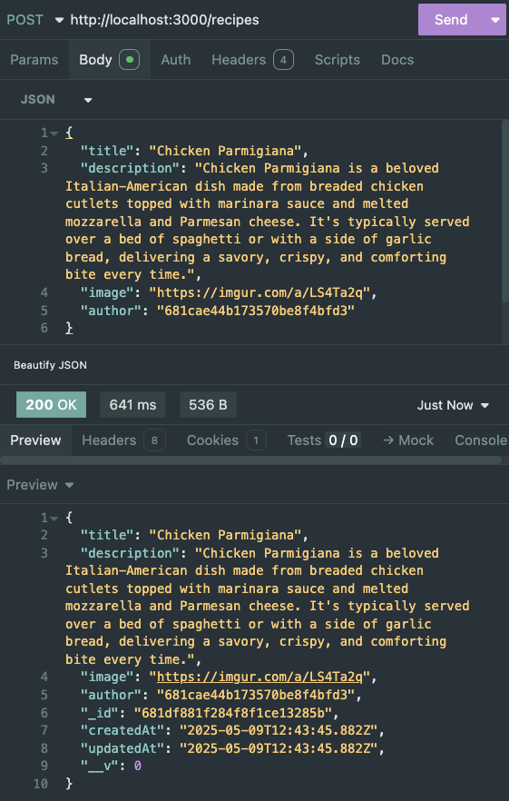

The pattern always works. Every time.

[📖 Back to Top](#-table-of-contents)

---


### Getting All Recipes

Route - Controller - Testing. You know.

In `recipeRouter`, We'll set up the method (`GET`) with the `router` object and point to the controller function we intend to use for it. Just under our `createRecipe`:

```js
router.get('/', )
```

The second argument to `.get` will be our imported controller (which we have not made yet). We'll call it `getAllRecipes`.

Let's pause here.

In `recipeController.js`, we'll set up this function.

Our models are already imported.

Now, let's start making our *async* `getAllRecipes` function.

```js
const getAllRecipes = async (req, res) => {
  try {

  } catch (error) {

  }
}
```

This one is very simple:
1. Use the `.find` method to query our `Recipe` collection
2. Send a response

Query the database:

```js
const recipes = await Recipe.find({})
// findAll returns an array of every document that matches the criteria. In this case, our options object is empty (so there's no criteria).
```

Now, we send a response:

```js
res.send(recipes)
// This will be an EJS page later...
```

Don't forget to handle your errors:

```js
} catch (error) {
  console.error('An error has occurred getting all recipes!', error.message)
}
```

At the bottom of our file, we'll add our new function to the export.

```js
module.exports = {
  createRecipe,
  getAllRecipes
}
```

<br>

<details>
<summary>💡 Our <b>getAllRecipes</b> function . . . </summary>

```js
const getAllRecipes = async (req, res) => {
  try {
    const recipes = await Recipe.find({})
    // findAll returns an array of every document that matches the criteria. In this case, our options object is empty (so there's no criteria).
    res.send(recipes)
    // This will be an EJS page later...
  } catch (error) {
    console.error('An error has occurred getting all recipes!', error.message)
  }
}
```

</details>

<br>

Now, head back to our `recipeRouter.js` file and we will hook it up.

In the route from earlier, we reference the function:

```js
router.get('/', recipeController.getAllRecipes)
```

<br>

<details>
<summary>💡 Our <b>recipeRouter</b> file so far . . . </summary>

```js
const express = require('express')
const router = express.Router()

const recipeController = require('../controllers/recipeController.js')

router.post('/', recipeController.createRecipe)
router.get('/', recipeController.getAllRecipes)

module.exports = router
```

</details>

<br>

Run your server...

```sh
npm start
```

You'll see:

```txt
Running Server on Port 3000 . . . 
Successfully connected to MongoDB database . . .
```

Now, we test with Insomnia or Postman - a `GET` request to `'http://localhost:3000/recipes'`. No need for a request body.

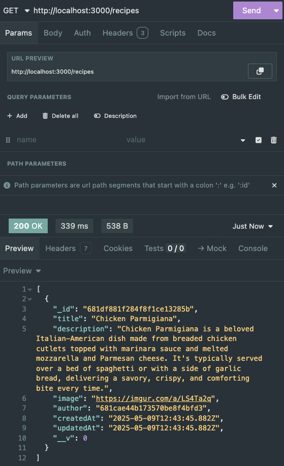

Follow. The. Pattern.

[📖 Back to Top](#-table-of-contents)

---


### Get a Single Recipe

Route - Controller - Testing.

In `recipeRouter`, We'll set up the method (`GET`) with the `router` object and point to the controller function we intend to use for it. Just under our `getAllRecipes`:

```js
router.get('/:id', )
```

The second argument to `.get` will be our imported controller (which we have not made yet). We'll call it `getRecipeById`.

Let's pause.

In `recipeController.js`, we'll set up this function.

Our models are already imported.

Now, let's start making our *async* `getRecipeById` function.

```js
const getRecipeById = async (req, res) => {
  try {

  } catch (error) {

  }
}
```

This one is also very simple:
1. Use the `.findById` method to query our `Recipe` collection
2. Send a response

Query the database:

```js
const recipe = await Recipe.findById(req.params.id)
```

Now, we send a response:

```js
res.send(recipe)
// This will be an EJS page later...
```

Don't forget to handle your errors:

```js
} catch (error) {
  console.error('An error has occurred getting a recipe!', error.message)
}
```

At the bottom of our file, we'll add our new function to the export.

```js
module.exports = {
  createRecipe,
  getAllRecipes,
  getRecipeById
}
```

<br>

<details>
<summary>💡 Our <b>getRecipeById</b> function . . . </summary>

```js
const getRecipeById = async (req, res) => {
  try {
    const recipe = await Recipe.findById(req.params.id)
    res.send(recipe)
    // This will be an EJS page later...
  } catch (error) {
    console.error('An error has occurred getting a recipe!', error.message)
  }
}
```

</details>

<br>

Now, head back to our `recipeRouter.js` file and we will hook it up.

In the route from earlier, we reference the function:

```js
router.get('/', recipeController.getRecipeById)
```

<br>

<details>
<summary>💡 Our <b>recipeRouter</b> file so far . . . </summary>

```js
const express = require('express')
const router = express.Router()

const recipeController = require('../controllers/recipeController.js')

router.post('/', recipeController.createRecipe)
router.get('/', recipeController.getAllRecipes)
router.get('/:id', recipeController.getRecipeById)

module.exports = router
```

</details>

<br>

Run your server...

```sh
npm start
```

You'll see:

```txt
Running Server on Port 3000 . . . 
Successfully connected to MongoDB database . . .
```

Now, we test with Insomnia or Postman - a `GET` request to `'http://localhost:3000/recipes/<some-recipe-id>'`. The `id` needs to be an ObjectID from *your* database.

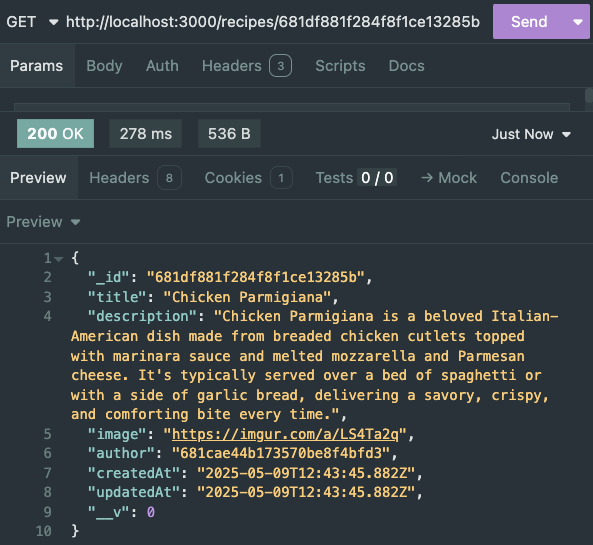

The pattern is a formula that will give you consistent success.

[📖 Back to Top](#-table-of-contents)

---


### Update a Recipe

1. Route
2. Controller
3. Testing

In `recipeRouter`, We'll set up the method (`PUT`) with the `router` object and point to the controller function we intend to use for it. Just under our `getRecipeById`:

```js
router.put('/:id', )
```

The second argument to `.put` will be our imported controller (which we have not made yet). We'll call it `updateRecipeById`.

Pause.

In `recipeController.js`, we'll set up this function.

Our models are already imported.

Now, let's start making our *async* `updateRecipeById` function.

```js
const updateRecipeById = async (req, res) => {
  try {

  } catch (error) {

  }
}
```

For this, we'll follow these steps:
1. Find and Update the recipe using the id from the params
2. Passing in the updated fields
3. Send a response

Find the recipe:

```js
const recipe = await Recipe.findByIdAndUpdate(req.params.id, )
```

The second argument to `findByIdAndUpdate` is an object with the updated fields - `req.body`. 

The third argument is an optional object with various options in it. The option we want is `new: true`. This ensures that the updated record is returned from the database:

```js
const recipe = await Recipe.findByIdAndUpdate(req.params.id, req.body, { new: true })
// req.body overwrites any matching fields with the new values. Only the updated fields are necessary.
// { new: true } ensures that the updated record is what is returned
```

Now, we send a response:

```js
res.send(recipe)
// This will be an EJS page later...
```

Don't forget to handle your errors:

```js
} catch (error) {
  console.error('An error has occurred updating a recipe!', error.message)
}
```

At the bottom of our file, we'll add our new function to the export.

```js
module.exports = {
  createRecipe,
  getAllRecipes,
  getRecipeById,
  updateRecipeById
}
```

<br>

<details>
<summary>💡 Our <b>updateRecipeById</b> function . . . </summary>

```js
const updateRecipeById = async (req, res) => {
  try {
    const recipe = await Recipe.findByIdAndUpdate(req.params.id, req.body, { new: true })
    // req.body overwrites any matching fields with the new values. Only the updated fields are necessary.
    res.send(recipe)
    // This will be an EJS page later...
  } catch (error) {
    console.error('An error has occurred updating a recipe!', error.message)
  }
}
```

</details>

<br>

Now, head back to our `recipeRouter.js` file and we will hook it up.

In the route from earlier, we reference the function:

```js
router.put('/:id', recipeController.updateRecipeById)
```

<br>

<details>
<summary>💡 Our <b>recipeRouter</b> file so far . . . </summary>

```js
const express = require('express')
const router = express.Router()

const recipeController = require('../controllers/recipeController.js')

router.post('/', recipeController.createRecipe)
router.get('/', recipeController.getAllRecipes)
router.get('/:id', recipeController.getRecipeById)
router.put('/:id', recipeController.updateRecipeById)

module.exports = router
```

</details>

<br>

Run your server...

```sh
npm start
```

You'll see:

```txt
Running Server on Port 3000 . . . 
Successfully connected to MongoDB database . . .
```

Now, we test with Insomnia or Postman - a `PUT` request to `'http://localhost:3000/recipes/<some-recipe-id>'`. The `id` needs to be an ObjectID from *your* database. The request body might look something like this:

```json
{
  "title": "Mom's Famous Chicken Parmigiana"
}
```

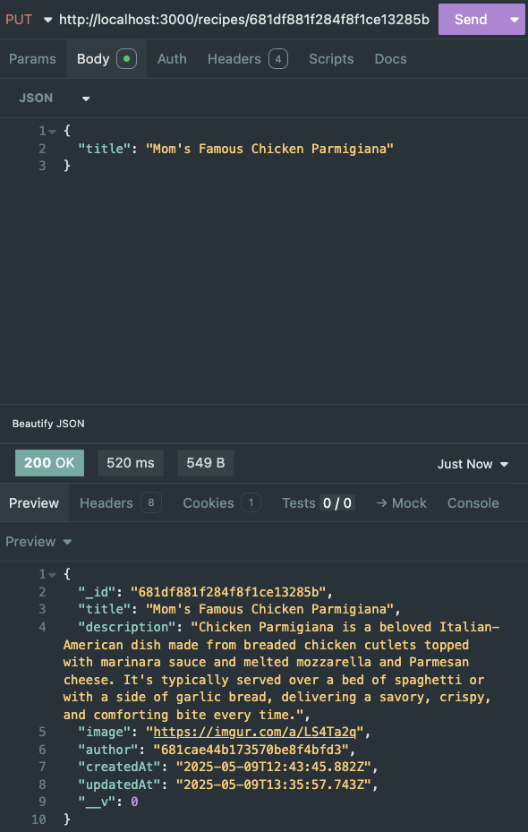

What's for dinner? Mom's Famous Pattern.

[📖 Back to Top](#-table-of-contents)

---


### Delete a Recipe

New day. Same pattern.

In `recipeRouter`, We'll set up the method (`DELETE`) with the `router` object and point to the controller function we intend to use for it. Just under our `updateRecipeById`:

```js
router.delete('/:id', )
```

The second argument to `.delete` will be our imported controller (which we have not made yet). We'll call it `deleteRecipeById`.

Leave this for now.

In `recipeController.js`, we'll set up this function.

Our models are already imported.

Now, let's start making our *async* `deleteRecipeById` function.

```js
const deleteRecipeById = async (req, res) => {
  try {

  } catch (error) {

  }
}
```

For this, we'll follow these steps:
1. Find and Delete the recipe using the id from the params
2. Send a response

Find and delete the recipe:

```js
await Recipe.findByIdAndDelete(req.params.id)
// No need to store this in a variable since it's being deleted
```

Send a response:

```js
res.send(`Recipe with ID ${req.params.id} has been deleted successfully!`)
// This will be an EJS page later...
```

Handle errors:

```js
} catch (error) {
  console.error('An error has occurred deleting a recipe!', error.message)
}
```

At the bottom of our file, we'll add our new function to the export.

```js
module.exports = {
  createRecipe,
  getAllRecipes,
  getRecipeById,
  updateRecipeById
}
```

<br>

<details>
<summary>💡 Our <b>deleteRecipeById</b> function . . . </summary>

```js
const deleteRecipeById = async (req, res) => {
  try {
    await Recipe.findByIdAndDelete(req.params.id)
    // No need to store this in a variable since it's being deleted
    res.send(`Recipe with ID ${req.params.id} has been deleted successfully!`)
    // This will be an EJS page later...
  } catch (error) {
    console.error('An error has occurred deleting a recipe!', error.message)
  }
}
```

</details>

<br>

Now, head back to our `recipeRouter.js` file and we will hook it up.

In the route from earlier, we reference the function:

```js
router.delete('/:id', recipeController.deleteRecipeById)
```

<br>

<details>
<summary>💡 Our <b>recipeRouter</b> file so far . . . </summary>

```js
const express = require('express')
const router = express.Router()

const recipeController = require('../controllers/recipeController.js')

router.post('/', recipeController.createRecipe)
router.get('/', recipeController.getAllRecipes)
router.get('/:id', recipeController.getRecipeById)
router.put('/:id', recipeController.updateRecipeById)
router.delete('/:id', recipeController.deleteRecipeById)

module.exports = router
```

</details>

<br>

Run your server...

```sh
npm start
```

You'll see:

```txt
Running Server on Port 3000 . . . 
Successfully connected to MongoDB database . . .
```

Now, we test with Insomnia or Postman - a `DELETE` request to `'http://localhost:3000/recipes/<some-recipe-id>'`. The `id` needs to be an ObjectID from *your* database. No request body.

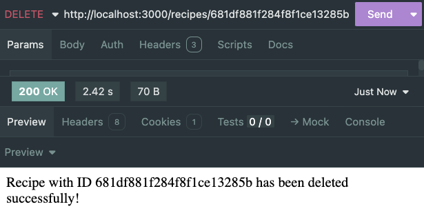

The pattern once again shows us it's quality.

[📖 Back to Top](#-table-of-contents)

---


## Reflecting on the Server Build

With this final operation, we have finished creating and testing our entire back-end server.  We have all the functionality we want for our website and the ability to interact with the database how we need.

Now, as we move forward and create and test our "front-end" views, we will know that our server is complete. This allows us to more appropriately troubleshoot issues. By knowing that the issue must be coming from our EJS/HTML structure and/or our browser, we can more effectively track them down and solve the errors.

This same mindset should be used in real world websites *and* your projects.

[📖 Back to Top](#-table-of-contents)

---


## Creating Our EJS Views

In this section, we will transition to the "front-end" / client-facing part of our website. We'll largely be copying/pasting EJS templates that will be given to you. As we do, we'll discuss and review each page and it's purpose. Then, we'll be setting up routes and controllers for each to ensure our pages are rendered/redirected appropriately.


---

### Home Page & Partials

Let's create a landing page for our website. Then, we'll set up our base route (`'/'`) to render the EJS file.

First off, we need a `views` directory.

```sh
mkdir views
```

And create our `index.ejs` file.

```sh
touch ./views/index.ejs
```

Before we get to work in this file, we know we'll also need a few partials. One of these will be all of our head HTML and another will be the footer of every page. So let's create that directory and two files as well.

```sh
mkdir ./views/partials
```

```sh
touch ./views/partials/header.ejs ./views/partials/footer.ejs
```

In the following sections, you can copy/paste the EJS from these snippets to their respective files. Or, feel free to create your own!

<br>

<details>
<summary>💡 <b>index.ejs</b></summary>

```html
<%- include('./partials/header.ejs') %>

<h1>Welcome to Mongoose Recipes!</h1>
<p>Sign in or sign up to get started.</p>

<%- include('./partials/footer.ejs') %>
```

</details>

<br>

<details>
<summary>💡 <b>header.ejs</b></summary>

```html
<!DOCTYPE html>
<html lang="en">
  <head>
    <meta charset="UTF-8" />
    <meta name="viewport" content="width=device-width, initial-scale=1.0" />
    <title>Mongoose Recipes</title>
    <link rel="stylesheet" href="/style.css" />
  </head>
  <body>
    <nav>
      <a href="/">Home</a>
      <a href="/recipes">All Recipes</a>

      <% if (!user) { %>
      <a href="/auth/sign-up">Sign Up</a>
      <a href="/auth/sign-in">Sign In</a>
      <% } else { %>
      <a href="/recipes/new">New Recipe</a>
      <a href="/users/<%= user._id %>">My Profile</a>
      <a href="/auth/sign-out">Sign Out</a>
      <% } %>
    </nav>
    <main>
```

</details>

<br>

For our header to be able to use the `session` object to conditionally render the nav, we need to set up a middleware in our `server.js`. Just under our middleware stack:

```js
app.use((req, res, next) => {
  res.locals.user = req.session.user
  next()
})
```

<br>

<details>
<summary>💡 <b>footer.ejs</b></summary>

```html
    </main>
    <footer>
      <p>&copy; <%= new Date().getFullYear() %> Mongoose Recipes</p>
    </footer>
  </body>
</html>
```

</details>

<br>

Now, we'll set up our base route in `server.js` to render our `index.js`. This replaces our old `res.send`.

```js
app.get('/', (req, res) => {
  res.render('index.ejs')
})
```

When you open `'http://localhost:3000/'` in your browser you should see your home page.

[📖 Back to Top](#-table-of-contents)

---


### Sign Up Page

Let's allow users to sign up and create an account.

In terminal:

```sh
mkdir ./views/auth
```

Then:

```sh
touch ./views/auth/sign-up.ejs
```

<br>

<details>
<summary>💡 <b>sign-up.ejs</b></summary>

```html
<%- include('../partials/header.ejs') %>

<h2>Sign Up</h2>
<form action="/auth/sign-up" method="POST">
  <input type="text" name="first" placeholder="First Name" required />
  <input type="text" name="last" placeholder="Last Name" required />
  <input type="email" name="email" placeholder="Email" required />
  <input type="text" name="picture" placeholder="Profile Picture URL" />
  <input type="password" name="password" placeholder="Password" required />
  <input type="password" name="confirmPassword" placeholder="Confirm Password" required />
  <button type="submit">Register</button>
</form>

<%- include('../partials/footer.ejs') %>
```

</details>

<br>

Now, let's create a route to render this view.

In `authRouter.js`:

```js
router.get('/sign-up', (req, res) => {
  res.render('./auth/sign-up.ejs')
})
```

No separate controller is needed in this case since it's a simple render route.

[📖 Back to Top](#-table-of-contents)

---


### Thank You Page

Let's also make a page that thanks them for signing up:

```sh
touch ./views/auth/thanks.ejs
```

<br>

<details>
<summary>💡 <b>thanks.ejs</b></summary>

```html
<%- include('../partials/header.ejs') %>

<h2>Thanks for signing up, <%= user.first %>!</h2>

<%- include('../partials/footer.ejs') %>
```

</details>

<br>

In `authController.js`, we'll render this EJS page after the user registers.

In `registerUser.js`, replace our `res.send` with this:

```js
res.render('./auth/thanks.ejs', { user })
```

[📖 Back to Top](#-table-of-contents)

---


### Sign In Page

We also need a view to allow existing users to sign in.

```sh
touch ./views/auth/sign-in.ejs
```

<br>

<details>
<summary>💡 <b>sign-in.ejs</b></summary>

```html
<%- include('../partials/header.ejs') %>

<h2>Sign In</h2>
<form action="/auth/sign-in" method="POST">
  <input type="email" name="email" placeholder="Email" required />
  <input type="password" name="password" placeholder="Password" required />
  <button type="submit">Sign In</button>
</form>

<%- include('../partials/footer.ejs') %>
```

</details>

<br>

Then in `authRouter.js`, add:

```js
router.get('/sign-in', (req, res) => {
  res.render('./auth/sign-in.ejs')
})
```

No separate controller is needed in this case since it's a simple render route.

After our user signs in, let's redirect them to their profile page which we'll set up later.

In `authController.js`, in our `signInUser.js` controller, replace the `res.send` with this:

```js
res.redirect(`/users/${user._id}`)
```

This won't work yet, but we'll set it up soon.

[📖 Back to Top](#-table-of-contents)

---


### Update Password Page

This page allows the user to update their password.

```sh
touch ./views/auth/update-password.ejs
```

<br>

<details>
<summary>💡 <b>update-password.ejs</b></summary>

```html
<%- include('../partials/header.ejs') %>

<h2>Update Password</h2>
<form action="/auth/<%= user._id %>?_method=PUT" method="POST">
  <input type="password" name="newPassword" placeholder="New Password" required />
  <input type="password" name="confirmPassword" placeholder="Confirm New Password" required />
  <button type="submit">Update</button>
</form>

<%- include('../partials/footer.ejs') %>
```

</details>

<br>

In `authRouter.js`, render the route using our session object to grab the user info:

```js
router.get('/:id/update-password', (req, res) => {
  res.render('./auth/update-password.ejs')
})
```

[📖 Back to Top](#-table-of-contents)

---


### User Profile Page

This page displays a user's profile info and their recipes.

```sh
mkdir ./views/users
```

Then, create the file:

```sh
touch ./views/users/profile.ejs
```

<br>

<details>
<summary>💡 <b>profile.ejs</b></summary>

```html
<%- include('../partials/header.ejs') %>

<h2><%= user.first %> <%= user.last %>'s Profile</h2>
" alt="Profile Picture" width="150" />

<div>
  <a href=<%= `/auth/${user._id}/update-password` %>>Update Password</a>
</div>

<h3>Recipes:</h3>
<ul>
  <% user.recipes.forEach(recipe => { %>
    <li><a href="/recipes/<%= recipe._id %>"><%= recipe.title %></a></li>
  <% }) %>
</ul>

<%- include('../partials/footer.ejs') %>
```

</details>

<br>

Back in our `userController.js`, we need to make sure we populate the recipes field when we get our user from the database.

Add `.populate('recipes')` to the end of the query:

```js
const user = await User.findById(req.params.id).populate('recipes')
```

Then, replace the `res.send` with the following:

```js
res.render('./users/profile.ejs', { user })
```

[📖 Back to Top](#-table-of-contents)

---


### Confirmed Page

We also need a page that confirms the password has been updated. We'll render it after we update the password in the database.

```sh
touch ./views/auth/confirm.ejs
```

<br>

<details>
<summary>💡 <b>confirm.ejs</b></summary>

```html
<%- include('../partials/header.ejs') %>

<h2>Your password has been updated, <%= user.first %>!</h2>

<%- include('../partials/footer.ejs') %>
```

</details>

<br>

In our `authController.js` file, we need to replace the `res.send` in our `updatePassword` controller with:

```js
res.render('./auth/confirm.ejs', { user })
```


---

### All Recipes Page

A list of all recipes in the app.

```sh
touch ./views/recipes/all.ejs
```

<br>

<details>
<summary>💡 <b>all.ejs</b></summary>

```html
<%- include('../partials/header.ejs') %>

<h2>All Recipes</h2>
<ul>
  <% recipes.forEach(recipe => { %>
    <li>
      <a href="/recipes/<%= recipe._id %>"><%= recipe.title %></a>
    </li>
  <% }) %>
</ul>

<%- include('../partials/footer.ejs') %>
```

</details>

<br>

Over in our `recipeController.js`, we need to replace the `res.send` in `getAllRecipes` with a render of our new page:

```js
res.render('./recipes/all.ejs', { recipes })
```

[📖 Back to Top](#-table-of-contents)

---


### Show Recipe Page

A detailed view of a single recipe.

```sh
touch ./views/recipes/show.ejs
```

<br>

<details>
<summary>💡 <b>show.ejs</b></summary>

```html
<%- include('../partials/header.ejs') %>

<h2><%= recipe.title %></h2>
" alt="<%= recipe.title %>" width="300" />
<p><%= recipe.description %></p>

<a href="/recipes/<%= recipe._id %>/edit">Edit</a>

<form action="/recipes/<%= recipe._id %>?_method=DELETE" method="POST">
  <button type="submit">Delete</button>
</form>

<%- include('../partials/footer.ejs') %>
```

</details>

<br>

In `recipeController.js`, update the `res.send` in `getRecipeById` with:

```js
res.render('./recipes/show.ejs', { recipe })
```

[📖 Back to Top](#-table-of-contents)

---


### New Recipe Page

We need a form where users can create new recipes.

```sh
touch ./views/recipes/new.ejs
```

<br>

<details>
<summary>💡 <b>new.ejs</b></summary>

```html
<%- include('../partials/header.ejs') %>

<h2>New Recipe</h2>
<form action="/recipes" method="POST">
  <input type="text" name="title" placeholder="Title" required />
  <textarea name="description" placeholder="Description" required></textarea>
  <input type="text" name="image" placeholder="Image URL" />
  <input type="hidden" name="author" value="<%= user._id %>" />
  <button type="submit">Create</button>
</form>

<%- include('../partials/footer.ejs') %>
```

</details>

<br>

Route to render the form in `recipeRouter.js`. This needs to go above any `'/:id'` routes:

```js
router.get('/new', (req, res) => {
  res.render('./recipes/new.ejs')
})
```

After we create a new recipe, we need to redirect to the recipe details page. In our `recipeController.js` file, in `createRecipe`, replace the `res.send` with:

```js
res.redirect(`/recipes/${recipe._id}`)
```

[📖 Back to Top](#-table-of-contents)

---


### Edit Recipe Page

A form to edit an existing recipe.

```sh
touch ./views/recipes/edit.ejs
```

<br>

<details>
<summary>💡 <b>edit.ejs</b></summary>

```html
<%- include('../partials/header.ejs') %>

<h2>Edit Recipe</h2>
<form action="/recipes/<%= recipe._id %>?_method=PUT" method="POST">
  <input type="text" name="title" value="<%= recipe.title %>" required />
  <textarea name="description" required><%= recipe.description %></textarea>
  <input type="text" name="image" value="<%= recipe.image %>" />
  <button type="submit">Update</button>
</form>

<%- include('../partials/footer.ejs') %>
```

</details>

<br>

In `recipeRouter.js`, we need to import our `Recipe` model because we'll need the recipe details when we edit:

```js
const Recipe = require('../models/Recipe.js')
```

```js
router.get('/:id/edit', async (req, res) => {
  const recipe = await Recipe.findById(req.params.id)
  res.render('./recipes/edit.ejs', { recipe })
})
```

After we update the recipe, we need to redirect to the recipe details page. In our `recipeController.js` file, in `updateRecipeById`, replace the `res.send` with:

```js
res.redirect(`/recipes/${recipe._id}`)
```

[📖 Back to Top](#-table-of-contents)

---


### Delete Recipe Confirm Page

A page that confirms to the user that the recipe has been deleted.

```sh
touch ./views/recipes/confirm.ejs
```

<br>

<details>
<summary>💡 <b>confirm.ejs</b></summary>

```html
<%- include('../partials/header.ejs') %>

<h2>Your recipe has been deleted!</h2>

<%- include('../partials/footer.ejs') %>
```

</details>

<br>

After we delete the recipe, we need to render the confirm page. In our `recipeController.js` file, in `deleteRecipeById`, replace the `res.send` with:

```js
res.render('./recipes/confirm.ejs')
```

[📖 Back to Top](#-table-of-contents)

---


## Styling (optional)

Here is some styling that will work with the EJS pages we've done so far, but feel free to make your own!

<br>

<details>
<summary>💡 <b>style.css</b></summary>

```css
@import url('https://fonts.googleapis.com/css2?family=Quicksand:wght@400;600&display=swap');

html,
body {
  margin: 0;
  padding: 0;
  min-height: 100vh;
}

body {
  display: flex;
  flex-direction: column;
  font-family: 'Quicksand', sans-serif;
  background-color: #f9f4ef;
  color: #4b3f2f;
  line-height: 1.6;
}

nav {
  background-color: #d8b99c;
  padding: 15px;
  text-align: center;
}

nav a {
  margin: 0 10px;
  color: #4b3f2f;
  font-weight: 600;
  text-decoration: none;
}

nav a:hover {
  text-decoration: underline;
}

main {
  flex-grow: 1;
  display: flex;
  flex-direction: column;
  align-items: center;
  padding: 40px 20px 20px;
  box-sizing: border-box;
}

h1,
h2,
h3 {
  color: #5b4636;
  margin-top: 0;
  text-align: center;
}

form {
  background: #fff8f0;
  border: 1px solid #d3c0ae;
  padding: 20px;
  margin: 20px 0;
  border-radius: 6px;
  box-shadow: 0 0 8px rgba(0, 0, 0, 0.05);
  max-width: 500px;
  width: 100%;
  text-align: left;
}

form input,
form textarea,
form button {
  display: block;
  width: 100%;
  padding: 10px;
  margin: 10px 0;
  font-family: inherit;
  border: 1px solid #bca98e;
  border-radius: 4px;
}

button {
  background-color: #b98962;
  color: white;
  border: none;
  cursor: pointer;
  transition: background 0.2s ease-in-out;
}

button:hover {
  background-color: #a36d4a;
}

ul {
  list-style-type: none;
  padding: 0;
}

ul li {
  margin: 10px 0;
  text-align: center;
}

footer {
  background-color: #d8b99c;
  text-align: center;
  padding: 10px;
  color: #4b3f2f;
}
```

</details>

<br>

[📖 Back to Top](#-table-of-contents)

---


## Recap

In this lesson, we learned how to set up a Node/Express server from scratch, how to create new models using the Mongoose Schema class, and how to write simple functions to perform CRUD operations on our database.  As our Node/Express applications grow in scale and get more complex in structure, these core principles will remain the same.

This is a BIG lesson, with lots of opportunities to make a mistake. So I've provided a [solution branch](https://github.com/NobodysLackey/mongoose-recipes/tree/solution) to this repository that you can clone down to see the final version.


## 📚 Resources

Documentation:
- [Node Docs](https://nodejs.org/docs/latest/api/)
- [Express Docs](https://expressjs.com/)
- [Mongoose Docs](https://mongoosejs.com/docs/guide.html)
- [morgan](https://www.npmjs.com/package/morgan)
- [dotenv](https://www.npmjs.com/package/dotenv)
- [method-override](https://www.npmjs.com/package/method-override)
- [express-session](https://www.npmjs.com/package/express-session)
- [bcrypt](https://www.npmjs.com/package/bcrypt)

ERD Tools:
- [Canva](http://www.canva.com)
- [Figma](https://www.figma.com)
- [draw.io](https://app.diagrams.net/)
- [LucidChart](https://www.lucidchart.com/)


[📖 Back to Top](#-table-of-contents)

---